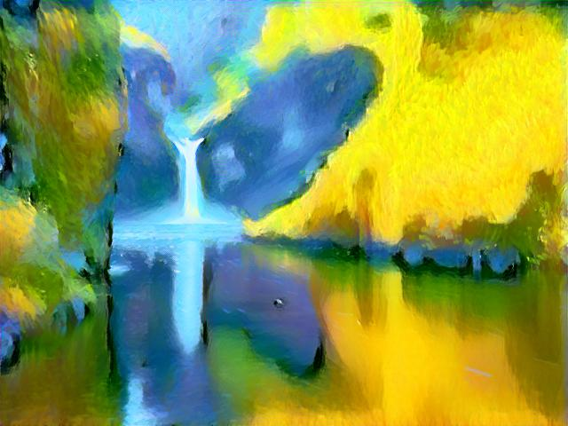
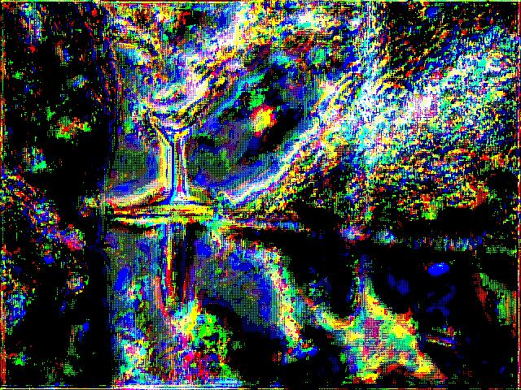
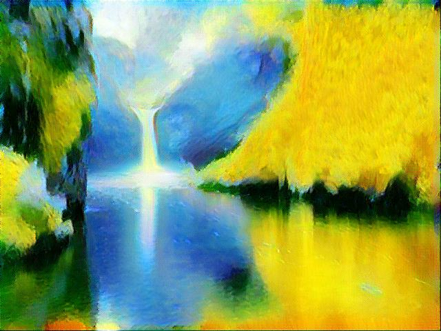
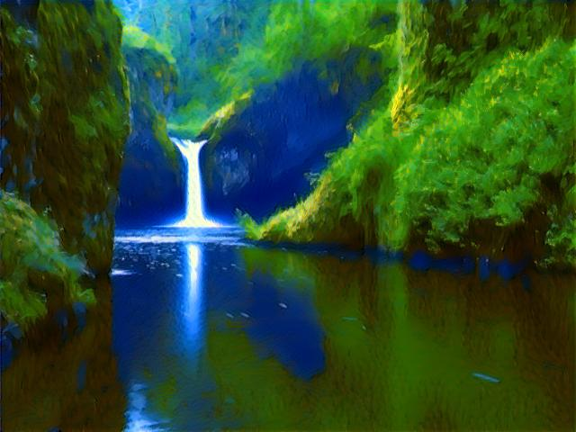
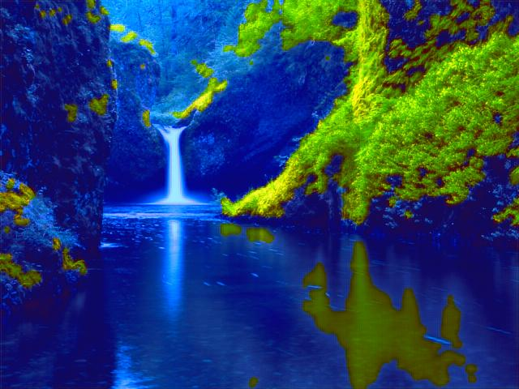
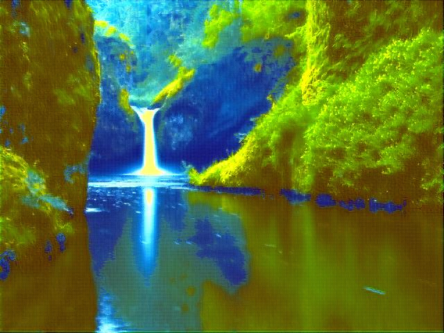
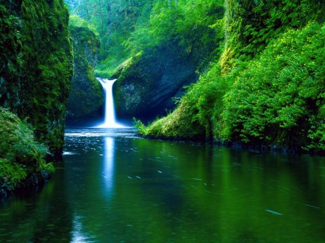
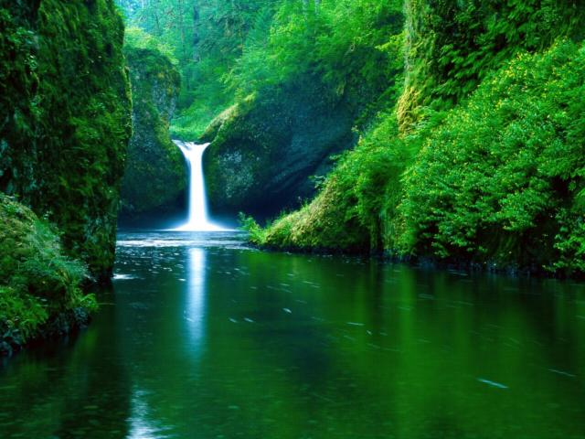

# Style Transfer 3x3 Analysis

<!-- Badges -->
<p>
  <a href="https://github.com/ayakiri/cov-project/graphs/contributors">
    
  </a>
  <a href="">
    
  </a>
</p>
<!-- Table of Contents -->


## Introduction
Style transfer is a technique in the field of Computer Vision that allows for transferring the appearance of one image onto another while preserving its original shape and layout. Thanks to advancements in neural networks and their ability to extract complex visual features, we can make, for example, an ordinary photo look like it was painted by a famous artist. Style transfer is popular in digital art, graphics, and photo editing.

The choice of appropriate tools is very important to achieve the best results in style transfer. We have two main tools: encoders and optimizers. Our goal is to find the best combination of encoder and optimizer to create the highest quality images.


## Dataset
The dataset "Images for Style Transfer" provided by Soumik Rakshit contains 27 example style images and 10 content images.
Source: https://www.kaggle.com/datasets/soumikrakshit/images-for-style-transfer

## Setup
Clone repository:
```bash
git clone https://github.com/ayakiri/cov-project.git
```
Install requirements:
```bash
poetry install
```

## Sample run
Run
```bash
python.exe .\main.py -fp "path/to/content/img.jpg" -sp "path/to/style/img.jpg" -op "path/to/save/img.jpg"
```

There are many arguments and parameters that we can change:
* **file-path** (-fp) - path to content image
* **output-path** (-op) - path to transformed image to be saved
* **style-path** (-sp) - path to style image
* **steps** (-s) - number of steps
* **encoder** (-e) - encoder ("vgg19", "resnet50", "inception_v3")
* **optimizer** (-o) - optimizer ("lbfgs", "adam", "sgd")

## Pre-commits
Install pre-commits
https://pre-commit.com/#installation

To use
```
pre-commit run --all-files
```

## Adding python packages
Dependencies are handeled by `poetry` framework, to add new dependency run
```
poetry add <package_name>
```


## Example pictures
Example pictures can be found in example_outputs directory.

|       | vgg19                                           | resnet50                                           | inception_v3                                                  |
|-------|-------------------------------------------------|----------------------------------------------------|---------------------------------------------------------------|
| LBFGS |  |  |  |
| ADAM  |    |    |    |
| SGD   |      |      |      |

## Results
To evaluate the effectiveness of different combinations of encoders and optimizers in style transfer, we conducted a survey. Participants were asked to rate the resulting images based on two criteria:

* Which image best captures the style?
* Which image do you like the most?
The survey included participants with varying levels of expertise in artificial intelligence, providing us with a diverse range of opinions.

Survey results indicated that Inception_V3 with LBFGS received the highest ratings for precise style transfer and image aesthetics. The second highest rated combination was VGG19 with LBFGS, also praised for its visually appealing results.

[Survey](https://forms.gle/7HAdPRxAAKWGnxdt6)


## Summary
Survey results clearly indicate that the combination of Inception_V3 with LBFGS is the most effective both in terms of style transfer and the aesthetics of the final images. Nevertheless, VGG19 with LBFGS also received high ratings, confirming its value. The SGD optimizer did not significantly impact the quality of results compared to LBFGS and Adam. Results with SGD often required more iterations to achieve comparable outcomes. ResNet50 with the LBFGS optimizer achieved less satisfactory results in our experiments, possibly due to differences in the ResNet50 architecture, which may require a different optimization approach.

Our study confirms that the choice of encoder and optimizer is crucial for the quality of style transfer results. Inception_V3, as a newer architecture, offers significant benefits, yet VGG19 remains a strong contender. The LBFGS optimizer proved to be the most effective in both evaluated categories, making it the preferred choice for style transfer tasks.
forms.gle

<!-- Contributing -->
## :wave: Contributors

<a href="https://github.com/ayakiri/cov-project/graphs/contributors">
  
</a>
